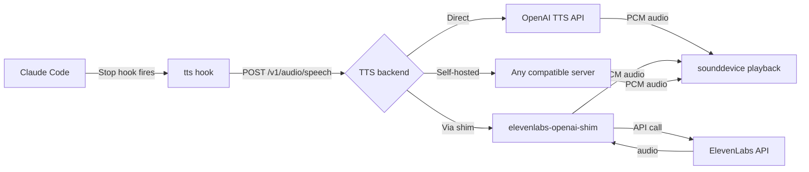

# tts

A Claude Code plugin that hooks into Claude's response lifecycle, sends the text to a TTS service, and plays it back through your speakers — so you can listen to Claude instead of reading.

## Installation
```
/plugin marketplace add torben-it/torben-it-marketplace
/plugin install tts@torben-it
```

### Local development
(Replace with the actual path to the plugin on your machine)
```
claude --plugin-dir /path/to/tts
```
Then reload:
```
/reload-plugins
```

## Usage

Toggle TTS on or off, check status, or stop current tts-playing:

```
/tts:on
/tts:off
/tts:status
/tts:stop
```

When enabled, every Claude response is automatically sent to a TTS server and played back through your speakers.

### Interrupting playback

If TTS is playing and you send a new prompt, playback stops automatically. The response to that prompt is also **not** read aloud — since you actively interrupted, the plugin assumes you don't want audio for the immediate next reply either. Subsequent responses will be read aloud as normal.

You can also stop playback explicitly:

```
/tts:stop
```

> **Tip:** `/tts` works as a shorthand — it gives Claude context about all TTS controls, so you can say things like "stop", "turn off tts", etc. in natural language.

## Requirements

- `jq` (for JSON parsing in the hook script)
- `uv` (Python package runner)
- `curl` (for sending requests to the TTS server)

### TTS server

This plugin requires a running TTS server with an OpenAI-compatible `/v1/audio/speech` endpoint that returns raw PCM audio (24kHz, 16-bit, mono). tts is provider-agnostic — it speaks the OpenAI request format, so any compatible backend works:

- **OpenAI TTS** — directly compatible. Set `TTS_URL` to `https://api.openai.com/v1/audio/speech`.
- **ElevenLabs via [elevenlabs-openai-shim](https://github.com/tvup/elevenlabs-openai-shim)** — a shim that exposes the same `/v1/audio/speech` interface but uses a fixed ElevenLabs voice and model under the hood. The default server (`tts.torbenit.online`) runs this shim.
- **Self-hosted** — any server implementing `/v1/audio/speech` that returns raw PCM.

You can point the plugin at any compatible server by setting the `TTS_URL` environment variable (see Configuration below).

If the TTS server is unreachable, the plugin fails silently and Claude continues to work normally — you just won't hear audio.

## Configuration

tts works out of the box with sensible defaults. The default TTS server is generously hosted by a kind soul so you can try the plugin and get a feel for it — but don't get too comfortable, the host isn't exactly swimming in gold coins, so it may not run forever.

For unlimited free testing, switch the model to `the-voice-in-your-head` — calls with this model are essentially unlimited, so go wild.

To use a different TTS server, voice, or model, create `~/.config/tts.env` to override the defaults:

| Variable | Description | Default |
|----------|-------------|---------|
| `TTS_URL` | TTS server endpoint | `https://tts.torbenit.online/v1/audio/speech` |
| `TTS_VOICE` | Voice ID — passed through to the underlying TTS provider | _(server default)_ |
| `TTS_MODEL` | TTS model name — passed through to the provider | _(server default)_ |
| `TTS_DEBUG` | Enable timing logs | `0` |

### Where to set them

You can set these environment variables wherever suits your workflow. Claude Code reads environment variables from several scopes — see [Environment variable configuration](https://docs.anthropic.com/en/docs/claude-code/settings) in the Anthropic docs for details on project vs. user vs. global settings.

One straightforward option is to create a config file at `~/.config/tts.env`:

```bash
# Example: local TTS server for development
TTS_URL="http://localhost:8880/v1/audio/speech"
TTS_VOICE="my-voice-id"
TTS_MODEL="my-model"
TTS_DEBUG=0
```

The hook script will source this file automatically if it exists. If no configuration is provided, defaults are used.

## How it works

1. A **Stop hook** fires whenever Claude finishes a response
2. The hook checks if TTS is enabled (`~/.claude/.tts-enabled`)
3. Markdown is stripped from the response (code blocks, links, formatting)
4. The cleaned text is sent to the TTS server
5. Audio is streamed via `sounddevice` (non-blocking, in background)

## Architecture



The plugin is provider-agnostic. The hook sends an OpenAI-shaped request (`POST /v1/audio/speech`) to whatever endpoint is configured. The response — raw PCM audio — is piped to `sounddevice` for playback. This means you can swap backends without changing any plugin code; just point `TTS_URL` at a different server.

The default server (`tts.torbenit.online`) runs [elevenlabs-openai-shim](https://github.com/tvup/elevenlabs-openai-shim) — a lightweight adapter that accepts OpenAI-shaped requests but generates speech through ElevenLabs.

## Troubleshooting

**No audio playback:**
- Check TTS is enabled: `/tts:status`
- Verify your TTS server is reachable: `curl -s -o /dev/null -w "%{http_code}" -X POST "$TTS_URL" -H "Content-Type: application/json" -d '{"input":"test","voice":"test","model":"test"}'`
- Ensure `jq` is installed: `jq --version`
- Ensure `uv` is installed: `uv --version`

**Wrong TTS server:**
- Verify that `TTS_URL` is set correctly in your environment (see Configuration above)
- Without any override, the default server (`https://tts.torbenit.online`) is used

**Audio suddenly stopped working (was working before):**
- The default server (`tts.torbenit.online`) has a cumulative character limit (default: 2000 characters total across all requests). Once your combined usage exceeds this limit, the server returns HTTP 429 for all subsequent requests. Since the plugin runs non-blocking in the background, you won't see an error — audio just silently stops. Try switching to `the-voice-in-your-head` model (unlimited) or use your own TTS server.

**Audio plays but sounds wrong:**
- The TTS server must return raw PCM audio: 24kHz sample rate, 16-bit, mono
- Other formats (MP3, WAV with headers, etc.) will produce garbled audio

## License

[MIT](LICENSE)
